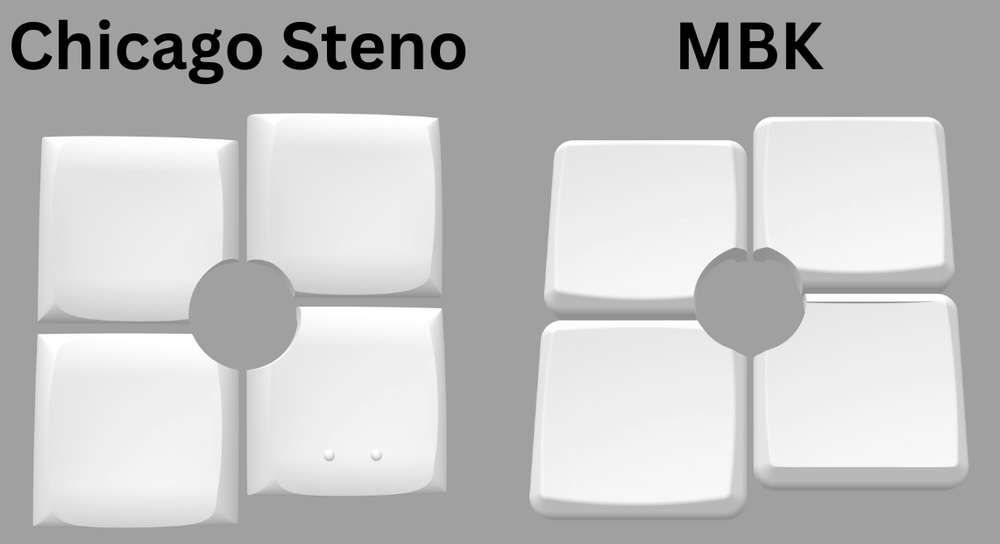
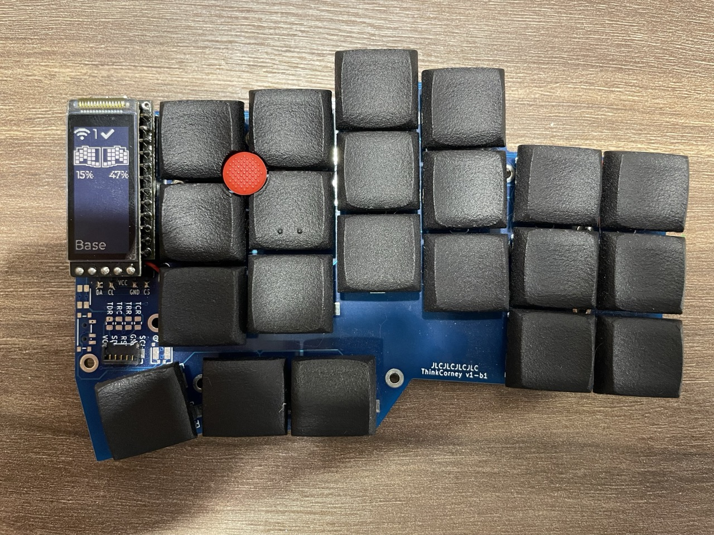
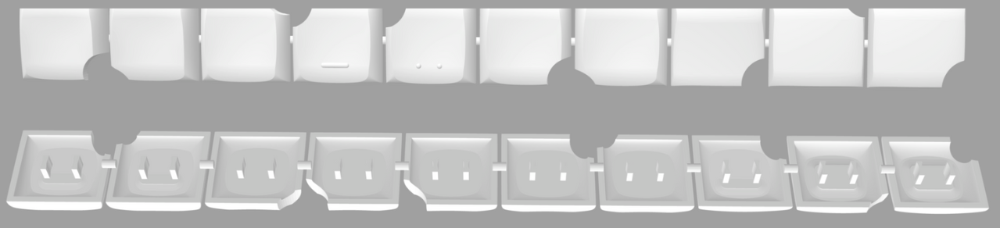

# Scripts to cut TrackPoint holes into keyboard keycaps

These scripts allow you to generate keycaps with a cutout for a TrackPoint.





Currently, Chicago Stenographer and MBK keycaps are supported, but it's trivial to add other models as long as you have the stl files.

The generated STLs are sprued and optimized for printing at JLCPCB:



This repo was inspired by the awesome idea and work of [wolfwood's printed-keycap-mods](https://github.com/wolfwood/printed-keycap-mods).

However, their code didn't support MBK and is optimized for DIY printing with FDM rather than JLCPCB.

## 1. Table of Contents <!-- omit from toc -->

- [1. Printing / Ordering](#1-printing--ordering)
  - [1.1. How to download the STLs and which files to use](#11-how-to-download-the-stls-and-which-files-to-use)
  - [1.2. How to order on JLCPCB](#12-how-to-order-on-jlcpcb)
  - [1.3. How to print them yourself](#13-how-to-print-them-yourself)
- [2. Using the scripts](#2-using-the-scripts)
  - [2.1. How to generate your own keycaps](#21-how-to-generate-your-own-keycaps)
  - [2.2. How to fix large STL file sizes](#22-how-to-fix-large-stl-file-sizes)
  - [2.3. How to adjust the stagger](#23-how-to-adjust-the-stagger)
  - [2.4. How to adjust the key spacing](#24-how-to-adjust-the-key-spacing)
  - [2.5. How to add a new keycap type](#25-how-to-add-a-new-keycap-type)
- [3. Related Resources \& Projects](#3-related-resources--projects)
- [4. License](#4-license)

## 1. Printing / Ordering

### 1.1. How to download the STLs and which files to use

Go to the [releases section](releases) and download the STL files.

You can find combined STLs that contain all the variations you might need in the `./combined/` folder.

The published files are generated for choc-spaced boards with a stagger of 2.375 (what the corne uses). You can follow the instructions below to generate keycaps with customized spacing and stagger.

Chicago Stenographer has many different variations of keycaps. To understand which ones to use and what the differences are, [check out my fork of those keycaps](https://github.com/infused-kim/kb_keycaps_chicago_stenographer).

There you will also find the rest of the keycaps needed to print a full set or you can buy a full set from the creator [at asymplex.xyz](https://www.asymplex.xyz).

MBK keycaps are not really meant to be printed, so you should buy the rest of the keycaps from one of the many vendors that sell them.

### 1.2. How to order on JLCPCB

* Upload the STL model
* Select 3D Technology: `MJF (Nylon)`
* Select Material: `PA12-HP Nylon`
* Optionally select Surface Finish: `Add - Dyeing - Dyed Black` to get black keycaps.
  * Without this they will be a "textured gray"
* Make sure to select the correct Quantity

The two combined sets should cost $5.05.

### 1.3. How to print them yourself

I have no clue... I don't own a 3D printer and this is my first 3D modeling project.

You can check out [wolfwood's printed-keycap-mods](https://github.com/wolfwood/printed-keycap-mods) as his project is optimized for FDM printing.

You may also find [these instructions](https://www.printables.com/model/158865-chicago-steno-low-profile-ergo-keycaps) valuable.

Perhaps you can modify the files here manually.

I would also be happy to accept a PR that generates STLs that are optimized for printing yourself.

## 2. Using the scripts

### 2.1. How to generate your own keycaps

* Install OpenSCAD
  * The [snapshot version](https://openscad.org/downloads.html#snapshots) is recommended for performance reasons
  * If it crashes, [try an older version of the snapshot](https://files.openscad.org/snapshots/)
* Set up the dev environment
  * Adjust the Makefile with the path to your OpenSCAD installation
* Run the keycap generator
  * Run `make help` to see all available targets
  * Or run `make` to build everything

You can also open the individual files in the OpenSCAD GUI if you prefer.

### 2.2. How to fix large STL file sizes

OpenSCAD generates files with very big sizes and JLCPCB only allows files to be up to 80mb.

To fix this Fusion360 (The free version is fine)...

* Create a new file
  * Do not open the STL directly. That will mess up the units
* Select the `Mesh` tab on the top toolbar
* Select `Insert Mesh` (first icon)
  * Select the STL file and click `Open`
  * This will load the model and show a `Insert Mesh` window
  * Make sure the `Unit Type` is set to `Millimeter`
  * Press the `OK` button
* Save it to the cloud
* Use `File -> Export` to export the file as STL again

The file size should now be under 80 MB.

### 2.3. How to adjust the stagger

You can adjust the stagger by running `make STAGGER=5.5`.

### 2.4. How to adjust the key spacing

By default, keycaps are cut using the choc spacing, but you can change the spacing to mx by running `make PROFILE=mx`.

You can also specify custom values by running `make PROFILE=custom SPREADX=20 SPREADY=22`.

But keep in mind that this doesn't change the size of the keycaps. It only changes the distance at which they are placed before cutting.

### 2.5. How to add a new keycap type

#### 3.5.1. Add the keycap STLs <!-- omit from toc -->

First, add the keycap STLs to the `./keycaps/` directory.

#### 3.5.2. Figure out the positioning offset of the keycaps <!-- omit from toc -->

The cutter expects the keycaps to be centered around the origin, but many keycap designers offset the keys slightly.

You can open the files in Fusion 360 or another 3D editor to figure out the offsets.

#### 3.5.3. Create the SCAD file <!-- omit from toc -->

Then duplicate the `src/gen_mbk.scad` file. Make sure the file name starts with `gen_` or the Makefile won't recognize it.

Adjust the keycap path and add the necessary positional adjustments.

For example, the MBK homing keycap was centered at `x: -23` and `y: 0`. So we moved it to the origin with:

```scad
// Keycap array: stl path, translate adjustment, rotation, mirror
mbk_1u_homing = [
    "../keycaps/mbk/mbk_keycap_1u_homing.stl",  // stl path

    [23, 0, 0],  // translate adjustment / movement
    [0, 0, 0],  // rotation
    [0, 0, 0]  // mirroring
];
```

Check out the [OpenSCAD documentation for translate, rotate, and mirror here](https://en.wikibooks.org/wiki/OpenSCAD_User_Manual/Transformations#rotate) for more information.

#### 3.5.4. Run the script <!-- omit from toc -->

Then just run the cutter with `make name_of_set` or  `make all`.

The name of the target will be the file name of your `.scad` file but without the `gen_` prefix and `.scad` extension.

For example `gen_my_keycap.scad` can be run with `make my_keycap`.

## 3. Related Resources & Projects

- [My TrackPoint Driver for DIY keyboards using the zmk firmware](https://github.com/infused-kim/kb_zmk_ps2_mouse_trackpoint_driver)
- [My TrackPoint Extensions](https://github.com/infused-kim/kb_trackpoint_extension)
- [My Chicago Stenographer Keycap Fork](https://github.com/infused-kim/kb_keycaps_chicago_stenographer)

## 4. License

**TLDR:**

* Personal use with attribution
* Commercial use not allowed

This work is licensed under a
[Creative Commons Attribution-ShareAlike 4.0 International License][cc-by-sa].

[![CC BY-SA 4.0][cc-by-sa-image]][cc-by-sa]

[cc-by-sa]: http://creativecommons.org/licenses/by-sa/4.0/
[cc-by-sa-image]: https://licensebuttons.net/l/by-sa/4.0/88x31.png
[cc-by-sa-shield]: https://img.shields.io/badge/License-CC%20BY--SA%204.0-lightgrey.svg
